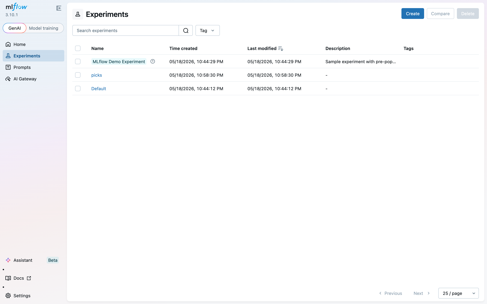
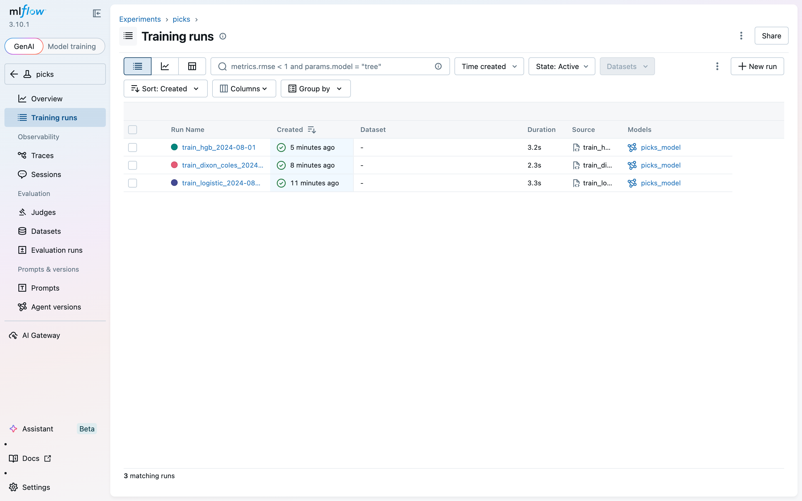
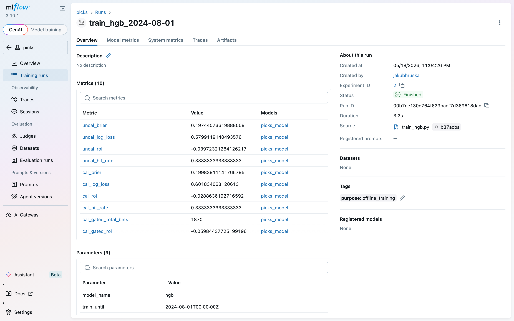
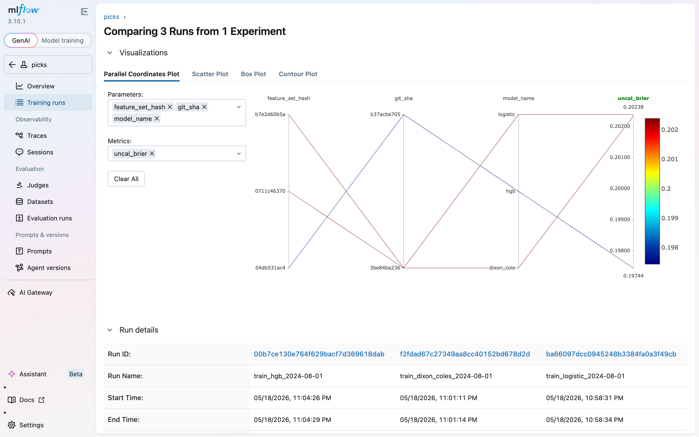
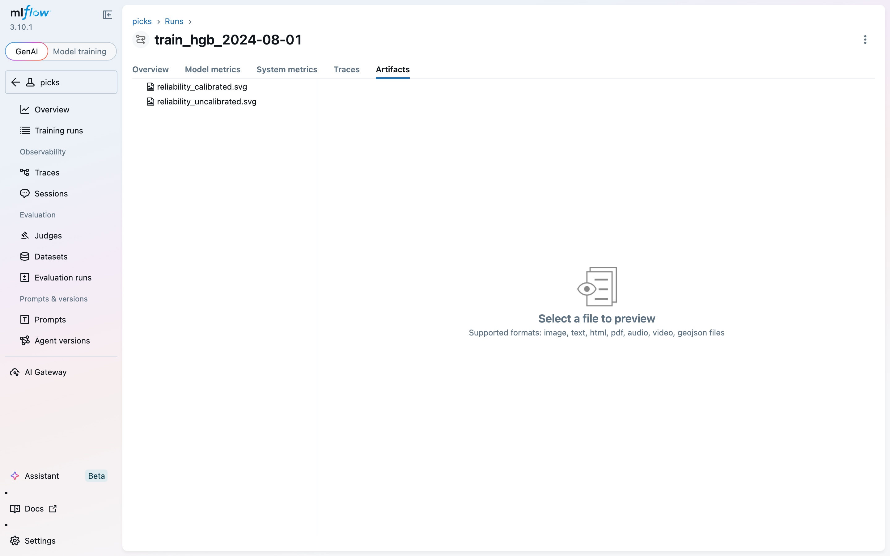

# MLflow lifecycle — operator manual

> **Scope.** This document covers how an operator (you, today) uses MLflow against the FlashScore picks codebase. It describes the **current Phase A** setup that's actually wired up, plus what Phases B–D will look like as the workstream lands. Skim the lifecycle map first, then jump to the section you need.

---

## TL;DR

- **Today (Phase A):** Local MLflow server. Every model fit — offline training scripts + UI-triggered backtests — logs to one experiment (`picks`) with a canonical schema. Browse, compare, sort by KPI in the MLflow UI. The app keeps using its on-disk model artifacts for live `/predict`.
- **Phase B:** Same code paths, hosted infrastructure (Postgres backend + S3 artifacts + nginx + auth). Point `MLFLOW_TRACKING_URI` and `NEXT_PUBLIC_MLFLOW_URL` at the hosted URL; nothing else changes.
- **Phase C:** Model Registry replaces `$APP_ML_MODELS_DIR/` as the serving gate. `mlflow.pyfunc.load_model("models:/logistic@champion")` resolves whichever version you promoted.
- **Phase D:** Daily retraining via scheduler. MLproject files for reproducibility. KPI-gated auto-promotion.

---

## Quick start (Phase A)

### 1. Start the tracking server

```bash
make mlflow
```

Server binds to `http://127.0.0.1:5000`. Backend store: `mlflow/mlflow.db` (SQLite). Artifact root: `./mlflow/artifacts/`. Both are gitignored. Keep the terminal open while you work — Ctrl+C stops it.

### 2. Verify it's up

Open <http://127.0.0.1:5000> in a browser. You should land on a `Home` page or experiments list. If you see this, the server is live:



The `picks` experiment is created automatically the first time any code path calls `mlflow.set_experiment("picks")` — see [§3 below](#3-create-some-runs).

### 3. Create some runs

Two entry points populate the `picks` experiment.

**(a) Offline training scripts** — run on your terminal:

```bash
PYTHONPATH=. APP_STORAGE_DB_PATH=$PWD/data/flashscore_snapshots.sqlite3 \
  MLFLOW_TRACKING_URI=http://127.0.0.1:5000 \
  python3 scripts/train_logistic.py --train-until 2024-08-01T00:00:00Z
```

Same pattern for `train_dixon_coles.py` and `train_hgb.py`. Each prints `[mlflow] logged training run: <run_id>` on success.

**(b) UI-triggered backtests** — click the **Run backtest** button on `/en/picks/models`, pick a model + train_until. The backend worker logs to MLflow after `finalize_run` completes. The new `mlflow` column on the BacktestRunsPanel links to the run page.

### 4. Browse runs

Click the `picks` experiment, then the **Training runs** tab in the left sidebar (Overview is the GenAI-flavored landing page, not what you want):



The screenshot above shows three runs — one per model — from offline training scripts. Each row has a clickable run name and a `picks_model` artifact column (the [pyfunc-packaged model](#what-gets-logged-where) we'll cover in a minute).

> **Cosmetic gotcha.** A stale `metrics.rmse < 1 and params.model = "tree"` search filter sometimes persists from MLflow's demo experiment. Click the `×` in the search box to clear it. Doesn't affect data, just visual noise.

### 5. Drill into one run

Click a run name. You land on the run detail page:



What you're looking at, top to bottom:

- **Metrics panel.** All ten canonical metrics for an `offline_training` run: `uncal_brier`, `cal_brier`, `uncal_log_loss`, `cal_log_loss`, plus the forced-gated bet-level KPIs (`cal_gated_roi`, `cal_gated_total_bets`, etc.) that test the model on the historical bet pool. For backtest runs, you'll see `sharpe_adjusted`, `return_per_bet`, `rmse_per_bet` here too.
- **About this run.** The experiment id (`2` in this screenshot — your `picks` may be `1` if you have no other experiments), the run id, the source script that produced it, and a git SHA (`b37acba` here) so you can reproduce.
- **Tags.** `purpose: offline_training` is the canonical tag that distinguishes training runs from `walk_forward_backtest` and (future) `scheduled_retrain` runs.
- **Parameters.** The canonical params: `model_name`, `train_until`, `market_spec_key`, `sport`, `market`, `feature_set_hash`, `n_features`, `n_train_events`, `git_sha`. Backtest runs add `test_until`, `min_edge`, `kelly_fraction`.

### 6. Compare runs

Back on the Training runs table, check the boxes next to 2+ runs and click **Compare** in the top bar. You get a parallel-coordinates plot across params and metrics:



This is the killer feature. The plot above shows three models (logistic, dixon_coles, hgb) trained at the same `train_until` against `uncal_brier`. The hgb run sits at the bottom of the Brier scale (~0.1974) — visibly best-calibrated, in one glance. Switch from Parallel Coordinates to Scatter Plot, Box Plot, or Contour Plot for different cuts.

Below the chart, you get a side-by-side params/metrics table for the selected runs — useful for "what was different about *this* run?" forensics.

### 7. Inspect a run's artifacts

Click the **Artifacts** tab on a run:



Two SVGs ride along: `reliability_calibrated.svg` and `reliability_uncalibrated.svg` — calibration plots auto-generated by the training script. You also see a `picks_model/` subdirectory (collapsed by default) containing the pyfunc-packaged model — see [§Architecture](#architecture-what-this-app-does-with-mlflow).

---

## Architecture: what this app does with MLflow

```
┌──────────────────────────────────────────────────────────────┐
│  CODEBASE                                                    │
│                                                              │
│  scripts/train_*.py ─┐                                       │
│                      │                                       │
│  BacktestManager  ───┼──→ app/ml/tracking.py                 │
│  ._execute            (single owner of MLflow writes)        │
│                      │                                       │
│                      │  ┌─ log_training_run()                │
│                      │  └─ log_backtest_run()                │
│                      │                                       │
│                      └──→ app/ml/pyfunc_wrapper.py           │
│                              (PicksModelWrapper)             │
│                              ↓                               │
└──────────────────────────────│───────────────────────────────┘
                               │
                               │  HTTP (MLFLOW_TRACKING_URI)
                               ↓
                  ┌──────────────────────────┐
                  │   mlflow server :5000    │
                  │                          │
                  │  SQLite ←── metadata     │
                  │  fs    ←── artifacts     │
                  └──────────────────────────┘
                               ↑
                               │  browser
                               │
                  ┌──────────────────────────┐
                  │  http://127.0.0.1:5000   │
                  │  (the UI you just used)  │
                  └──────────────────────────┘
```

### Ownership boundary

- **All MLflow writes** go through `app/ml/tracking.py`. No other module imports `mlflow` directly except `app/ml/pyfunc_wrapper.py`. This is enforced by convention (no lint rule yet) and makes Phase B's hosted-server swap painless — change one env var.
- **Model packaging** is uniform: `mlflow.pyfunc.PythonModel` via `PicksModelWrapper`. Whether the underlying object is a calibrated `TrainedLogistic`, a `TrainedHGB` with PCA preprocessing, a Dixon-Coles rates dict, or an analytic baseline like `market_implied` — the on-the-wire shape is the same: input is a `pd.DataFrame`, output is a `pd.DataFrame[home, draw, away]`. Phase C's "load from registry" line is one call: `mlflow.pyfunc.load_model("models:/logistic@champion")`.
- **The app's on-disk model artifacts** (under `$APP_ML_MODELS_DIR`) are unchanged. Phase A is **additive**: MLflow gets a copy for tracking, but the live `/predict` path still reads from disk. Phase C is the cutover.

### What gets logged where

| Surface | Phase A behavior |
| --- | --- |
| **Metrics** | `mlflow.log_metric(...)` per metric. Training runs: `uncal_*` / `cal_*` for Brier, log loss, ROI, hit rate. Backtest runs: `n_bets`, `hit_rate`, `roi`, `brier`, `log_loss`, `mean_clv`, `max_drawdown`, `return_per_bet`, `rmse_per_bet`, `sharpe_adjusted`. |
| **Params** | `mlflow.log_param(...)`. The 9 canonical params (see [run detail screenshot](#5-drill-into-one-run)) plus backtest extras. |
| **Tags** | `purpose ∈ {offline_training, walk_forward_backtest, scheduled_retrain}`. Backtest runs also tag `backtest_run_id=<SQLite id>` so you can cross-jump between the app's BacktestRunsPanel and the MLflow run. |
| **Model artifact** | `mlflow.pyfunc.log_model(...)` with `PicksModelWrapper` for `log_training_run`. Backtest runs **don't** log the trained model (they're evaluations, not production candidates). |
| **Extras** | Reliability SVGs as run artifacts via `mlflow.log_text`. |

### Cross-link between MLflow and the app

| Direction | Where to find it |
| --- | --- |
| **App → MLflow** | The `mlflow` column on BacktestRunsPanel renders a `view` link per row to `{NEXT_PUBLIC_MLFLOW_URL or http://127.0.0.1:5000}/#/experiments/<id>/runs/<run_id>`. |
| **MLflow → App** | Every backtest MLflow run carries tag `backtest_run_id = <SQLite id>`. Copy that id, then in the app: `/en/picks/explore?source=backtest&run_ids=<id>`. SQL: `SELECT * FROM backtest_runs WHERE id = '...'`. |
| **SQLite → MLflow** | `backtest_runs.mlflow_run_id` column. `SELECT id, model, mlflow_run_id, sharpe_adjusted FROM backtest_runs WHERE mlflow_run_id IS NOT NULL`. |

---

## Workflows

### Workflow 1: investigate a new model idea

Standard experimentation flow.

1. **Hypothesize.** "Does HGB with PCA on the 12-feature set beat plain HGB?"
2. **Implement.** Add a `fit_*_at` adapter in `app/ml/trainable.py` (one entry per model variant). Register it in `TRAINABLE`. The full TDD pattern is captured in the [Stage 2 plan](../superpowers/plans/2026-05-15-stage2-hgb-pca.md) — copy that shape.
3. **Run.** Trigger a backtest from `/en/picks/models` at a real `train_until`. The new model appears in the dropdown automatically because `/backtest/models` unions analytic + TRAINABLE keys.
4. **Compare.** In MLflow, filter runs by `params.train_until = "2024-08-01T00:00:00Z"`, sort by `metrics.sharpe_adjusted desc`. The Compare view confirms whether the new variant moves the needle.

### Workflow 2: kick off an offline training experiment

Same model, different hyperparameters / training cutoff.

```bash
PYTHONPATH=. APP_STORAGE_DB_PATH=$PWD/data/flashscore_snapshots.sqlite3 \
  MLFLOW_TRACKING_URI=http://127.0.0.1:5000 \
  python3 scripts/train_logistic.py --train-until 2024-08-01T00:00:00Z --C 0.5
```

Each `--C` value produces a separate MLflow run (params include the C value implicitly via the `model_name` or explicit log — extend the script if you want it sortable in the UI). For larger sweeps, write a small driver that loops + invokes the script.

> **State-of-the-art note.** Hyperparameter sweeps belong inside MLflow runs (as `mlflow.start_run(nested=True)` children, one per trial), not as parallel top-level runs. Phase A's training scripts log one run per invocation; a nested-runs pattern lands when sweeping becomes routine.

### Workflow 3: kick off a UI-triggered backtest

From `/en/picks/models` → **Run backtest** → pick model + train_until → submit. The worker:

1. Inserts a queued row in `backtest_runs`.
2. Trains the model in-memory via `resolve_model_for_backtest`.
3. Runs walk-forward via `app.ml.backtest.run_backtest`.
4. Persists the report into SQLite (`backtest_bets` for per-bet drilldown, `backtest_runs` for summary metrics incl. `sharpe_adjusted`).
5. **Logs everything to MLflow** with `purpose=walk_forward_backtest` and `backtest_run_id=<sqlite id>`.
6. Writes the MLflow run id back to `backtest_runs.mlflow_run_id`.

The MLflow run shows the same canonical params plus the 10 backtest metrics. The app's BacktestRunsPanel shows the link.

### Workflow 4: filter and search

The MLflow search bar at the top of the runs table accepts an SQL-ish syntax:

| Goal | Query |
| --- | --- |
| Only walk-forward backtests | `tags.purpose = "walk_forward_backtest"` |
| Only hgb runs | `params.model_name = "hgb"` |
| Profitable backtests | `tags.purpose = "walk_forward_backtest" and metrics.roi > 0.02` |
| Backtests at one cutoff | `params.train_until = "2024-08-01T00:00:00Z"` |
| Best Sharpe across history | (sort by `metrics.sharpe_adjusted desc`, no filter) |

Combine with `and` / `or`. Reset with the search-box `×`.

### Workflow 5: disable logging

For tests, dry runs, or "MLflow is down and I just want my backtest to finish":

```bash
APP_MLFLOW_DISABLED=1 python3 scripts/train_logistic.py ...
```

The full pytest suite sets this automatically in `tests/conftest.py`. When the MLflow server is *running but unreachable* (firewall, wrong URI), the disable gate trips on the first call: one structured warning `mlflow_disabled_for_process` to stderr, then silent no-ops for the rest of the process. SQLite writes are unaffected.

### Workflow 6: cross-jump between MLflow and the app

You're on a MLflow run, want to see the per-bet rows for that backtest:

1. Find the `backtest_run_id` tag on the MLflow run.
2. Open `/en/picks/explore?source=backtest&run_ids=<the-id>` in the app.

You're on a backtest row in BacktestRunsPanel, want to see the full MLflow detail:

1. Click the `view` link in the `mlflow` column.

---

## What an S&P500-grade MLflow setup looks like

The Phase A code already implements the parts of state-of-the-art that matter for code architecture. The parts that come later are infrastructure-level. Concretely:

| Capability | Phase A (today) | Phase B | Phase C | Phase D |
| --- | --- | --- | --- | --- |
| Tracking server | Local SQLite + filesystem | Postgres + S3 + nginx + OIDC/auth | (same) | (same) |
| Schema discipline | ✅ canonical params/metrics/tags | (same) | (same) | (same) |
| Pyfunc packaging | ✅ `PicksModelWrapper` | (same) | (same) | (same) |
| Disable gate | ✅ env var + auto-trip on server down | (same) | (same) | (same) |
| Cross-link to app | ✅ `backtest_run_id` tag + `mlflow_run_id` column | (same) | (same) | (same) |
| Model Registry | ❌ logs only; no register | ❌ | ✅ `register_model` + aliases | (same) |
| Alias-based serving | ❌ live serves from `$APP_ML_MODELS_DIR` | ❌ | ✅ `models:/logistic@champion` | (same) |
| MLproject reproducibility | ❌ | ❌ | ❌ | ✅ |
| Scheduled retraining | ❌ manual | (same) | (same) | ✅ cron / Airflow / Prefect |
| Auto-promotion gate | ❌ | (same) | (same) | ✅ KPI-thresholded |
| Hosted UI for the team | ❌ localhost only | ✅ | (same) | (same) |

A few notes on what "state-of-the-art" means concretely below.

### Aliases, not stages

MLflow's classic `Staging` / `Production` string stages are deprecated in 2.x+. The modern equivalent is **aliases** — arbitrary string labels you attach to a specific version. Phase C convention will be:

- `@challenger` — automatically set when a new model is registered.
- `@champion` — manually (or auto, via KPI gate) promoted; this is what serving loads.
- `@retired` — what champion becomes when superseded; kept around for rollback.

The serving call doesn't care about version numbers:

```python
model = mlflow.pyfunc.load_model("models:/logistic@champion")
```

Promotion is one call:

```python
client = mlflow.MlflowClient()
client.set_registered_model_alias("logistic", "champion", version=5)
```

Aliases are pointers — promoting a new version just reassigns `@champion`. The old version stays in the registry, fully reproducible.

### Run purpose taxonomy

A canonical `purpose` tag separates the three lifecycle stages an ML team thinks about:

- `offline_training` — experimentation. Run by an engineer. Goal: produce a candidate model.
- `walk_forward_backtest` — evaluation. Run by either an engineer or the UI. Goal: measure historical performance of a candidate.
- `scheduled_retrain` — production. Run by a scheduler. Goal: refresh the champion with fresh data. (Phase D.)

All three share the same canonical schema and the same `PicksModelWrapper` artifact format, which means MLflow's compare-across-time queries Just Work: "show me the Brier trend of `purpose=scheduled_retrain` runs for `model_name=hgb` over the last 90 days."

### Reproducibility (Phase D)

A run is reproducible if you can re-execute it bit-for-bit. Today we log `git_sha`, `feature_set_hash`, and `train_until` — enough to *understand* a run, not enough to *re-run* it. Phase D adds an `MLproject` file per script + a pinned `conda.yaml` / Docker image. Then:

```bash
mlflow run . -e train_logistic -P train_until=2024-08-01T00:00:00Z
```

Re-executes inside the pinned environment regardless of what your laptop looks like today.

---

## Reference

### Configuration

| Env var | Default | What it does |
| --- | --- | --- |
| `MLFLOW_TRACKING_URI` | `http://127.0.0.1:5000` | Where MLflow client connects. Phase B: change to hosted URL. |
| `APP_MLFLOW_DISABLED` | unset (= enabled) | Set to `1` to disable all MLflow writes for the process. |
| `NEXT_PUBLIC_MLFLOW_URL` | `http://127.0.0.1:5000` | Where the frontend's `view` link points. Same change as `MLFLOW_TRACKING_URI` for Phase B. |
| `APP_ML_MODELS_DIR` | `reports/` | Directory the live `/predict` path reads model artifacts from. Phase C: replaced by registry alias. |

### Files

| Path | Purpose |
| --- | --- |
| `app/ml/tracking.py` | Single MLflow-write owner. `log_training_run`, `log_backtest_run`. |
| `app/ml/pyfunc_wrapper.py` | `PicksModelWrapper` + `save_picks_model`. Universal model packaging. |
| `app/services/backtest_manager.py` | `_execute` calls `log_backtest_run` after `finalize_run`. |
| `scripts/train_*.py` | Offline training. Each calls `log_training_run`. |
| `tests/conftest.py` | Sets `APP_MLFLOW_DISABLED=1` so tests never touch MLflow. |
| `Makefile` | `make mlflow` target. |
| `docs/mlflow/` | This documentation. |
| `mlflow/` | Local server state — SQLite + artifacts. Gitignored. |

### Useful one-liners

```bash
# Total runs in the picks experiment
sqlite3 mlflow/mlflow.db \
  "SELECT COUNT(*) FROM runs r JOIN experiments e ON r.experiment_id=e.experiment_id WHERE e.name='picks';"

# Cross-link a SQLite backtest to its MLflow run
sqlite3 data/flashscore_snapshots.sqlite3 \
  "SELECT id, model, mlflow_run_id, sharpe_adjusted FROM backtest_runs WHERE mlflow_run_id IS NOT NULL ORDER BY created_at DESC LIMIT 10;"

# List MLflow runs via the REST API
curl -s -X POST http://127.0.0.1:5000/api/2.0/mlflow/runs/search \
  -H "Content-Type: application/json" \
  -d '{"experiment_ids":["2"], "max_results":10}' | jq '.runs[].info.run_id'
```

---

## Troubleshooting

| Symptom | Cause | Fix |
| --- | --- | --- |
| `make mlflow` says "address in use" | Another process holds `:5000`. | `lsof -ti:5000` then `kill <pid>`. |
| Run shows up in SQLite but not MLflow | `APP_MLFLOW_DISABLED=1` was set, OR the disable gate tripped (server was down at start of process). | Restart the process with the server up. |
| Frontend's `view` link 404s | Wrong experiment id in the URL template. | The code uses `experiments/1` by default; if your `picks` experiment is `2` (e.g. you have a demo experiment too), set `NEXT_PUBLIC_MLFLOW_URL` to point to the right path *or* update the link template. |
| "MLflow Demo Experiment" appears with auto-generated runs | Pre-existing demo data — MLflow ships sample runs for the AI Gateway/GenAI surface. Harmless. | Delete the experiment in the UI if it bothers you. |
| `purpose=walk_forward_backtest` runs missing | Backend was started without `MLFLOW_TRACKING_URI` set, or `APP_MLFLOW_DISABLED=1` is in its env. | Restart the backend with `MLFLOW_TRACKING_URI=http://127.0.0.1:5000` exported. |

---

## What's next

The next workstream brainstorms are:

- **Phase B** — hosted MLflow on a VPS. Postgres backend, S3-compatible artifacts, nginx + OIDC. One spec, ~3–5 days of work.
- **Phase C** — Model Registry as the serving gate. Replaces `$APP_ML_MODELS_DIR/` with `models:/<name>@champion` resolution at FastAPI startup. Promotion via `mlflow.MlflowClient().set_registered_model_alias`. ~2–3 days.
- **Phase D** — daily retraining via cron/Prefect + MLproject files for reproducibility + KPI-gated auto-promotion. ~1 week.

Each phase has its own spec + plan when we get there. The Phase A code paths don't change shape across the phases — what changes is **where** the data lives and **who** triggers the runs. The single ownership boundary in `app/ml/tracking.py` is what makes those changes one-line swaps instead of refactors.
